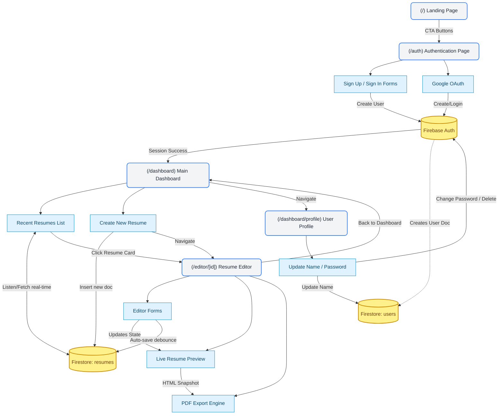

# 🚀 Team Feature Implementation Plan

This document serves as a comprehensive guide for sharing and implementing the frontend features of the Resume Builder application. It maps out each screen, the specific features required, how to implement them, and how Firebase (BaaS) will be integrated into the data flow.

---

## 🗺️ Visual Architecture Map

This diagram illustrates how screens connect to each other, which features live on each screen, and how they interact with Firebase.

---

## 🏗️ 1. Global Architecture & Setup

Before splitting up the screen tasks, the foundational global providers must be implemented.

### **Features**
- **Authentication State Management**: Knowing if a user is logged in across the app.
- **Protected Routing**: Preventing unauthenticated users from accessing `/dashboard` or `/editor`.
- **Database Schema**: Defining how Resumes are saved.

### **How-To & Firebase Connection**
1. **`AuthContext.tsx`**: 
   - Use `onAuthStateChanged(auth, (user) => {...})` from Firebase Auth.
   - Store the user session in a React Context so any component can access `currentUser`.
2. **`AuthGuard.tsx`**: 
   - A wrapper component for dashboard/editor routes. If `!currentUser`, redirect to `/auth`.
3. **Firestore Collections**:
   - `users/{uid}`: Stores user profile info (name, email, settings).
   - `resumes/{resumeId}`: Stores resume data. Each document should have a `userId` field to associate it with the owner.

---

## 🏠 2. Screen: Authentication (`/auth`)

This screen handles onboarding and user session creation.

### **Features**
- Email/Password Sign Up & Sign In.
- "Continue with Google" OAuth.
- Password Reset functionality.

### **How-To & Firebase Connection**
- **Email/Password**:
  - Implement form state using `react-hook-form` and `zod` for validation.
  - Call `createUserWithEmailAndPassword(auth, email, password)` for signups.
  - Call `signInWithEmailAndPassword(auth, email, password)` for sign-ins.
- **Google OAuth**:
  - Attach an onClick handler to the Google button calling `signInWithPopup(auth, new GoogleAuthProvider())`.
- **User Document Creation**:
  - Upon successful signup, intercept the credentials and write a document to the `users` collection in Firestore: `setDoc(doc(db, "users", user.uid), { email: user.email, createdAt: serverTimestamp() })`.
- **Connections**: 
  - On success, redirect the user to `/dashboard`.

---

## 📊 3. Screen: Dashboard (`/dashboard`)

The hub where users manage their created resumes.

### **Features**
- Display a grid/list of the user's saved resumes (`RecentResumes.tsx`).
- "Create New Resume" button.
- Delete, Duplicate, and Rename actions for each resume.

### **How-To & Firebase Connection**
- **Fetching Resumes**:
  - Use a Firestore query: `query(collection(db, "resumes"), where("userId", "==", currentUser.uid), orderBy("updatedAt", "desc"))`.
  - Listen in real-time using `onSnapshot` so the UI updates automatically if a resume is deleted.
- **Create New Resume**:
  - Clicking "Create New" generates a default JSON resume template.
  - Call `addDoc(collection(db, "resumes"), { title: "Untitled", data: defaultTemplate, userId: currentUser.uid })`.
  - Redirect the user to `/editor/[new_resume_id]`.
- **Connections**:
  - Links backward to `/auth` (if logging out).
  - Links forward to `/editor/[id]` when a resume card is clicked.
  - Links sideways to `/dashboard/profile`.

---

## 👤 4. Screen: User Profile (`/dashboard/profile`)

User settings and account management.

### **Features**
- Update display name.
- Change password.
- Delete Account.

### **How-To & Firebase Connection**
- **Update Profile**:
  - Form that calls `updateProfile(currentUser, { displayName: newName })`.
  - Sync the new name to the Firestore `users/{uid}` document using `updateDoc`.
- **Change Password**:
  - Call `updatePassword(currentUser, newPassword)`. (Requires recent login/re-authentication).
- **Delete Account**:
  - **CRITICAL**: Deleting the user via `deleteUser(currentUser)` in Firebase Auth.
  - *Cleanup*: Ensure you also delete all resumes in Firestore where `userId == currentUser.uid` before deleting the auth account to prevent orphaned data.
- **Connections**:
  - Accessed via the sidebar/navbar from the main Dashboard.

---

## ✏️ 5. Screen: Resume Editor (`/editor/[id]`)

The most complex screen. It consists of the editing tools and the live preview.

### **Features**
- Load specific resume data via URL parameter `[id]`.
- Dynamic forms for specific sections (Experience, Education, Skills, Projects).
- Auto-save functionality (debounce saves to avoid spamming the database).
- Live preview rendering.

### **How-To & Firebase Connection**
- **Data Hydration**:
  - On mount, parse the URL `id`.
  - Fetch the document: `getDoc(doc(db, "resumes", id))`. Populate the editor's React state with this data.
- **Auto-Save Mechanism**:
  - Use a global state manager (Zustand or React Context) to hold the active resume state.
  - Wrap the save function in a debounce (`useDebounce` hook).
  - Every time the user stops typing for ~1.5 seconds, call `updateDoc(doc(db, "resumes", id), { data: currentEditorState, updatedAt: serverTimestamp() })`.
- **Component Splitting (Team Task Assignment)**:
  - *Teammate A*: Build the modular input forms (Experience form, Education form) and state management.
  - *Teammate B*: Build the Live Preview component that consumes the state and renders the visual resume layout.
- **Connections**:
  - "Back" button returns to `/dashboard`.
  - "Download PDF" button triggers the export feature.

---

## 🖨️ 6. Feature: PDF Export

Exporting the visual resume into a downloadable PDF format.

### **Features**
- Convert HTML/DOM nodes to a PDF file.

### **How-To & Firebase Connection**
- **Implementation Options**:
  - *Client-side*: Use libraries like `html2canvas` and `jsPDF`, or `react-to-print`. When the user clicks "Download", you grab the specific `div` ID of the Preview panel and convert it directly in the browser.
  - *Server-side (Advanced)*: No immediate Firebase requirement, but you could send the JSON payload to a Next.js API route that uses Puppeteer to render and return a PDF buffer. Client-side is recommended for V1.
- **Connections**:
  - Triggered exclusively from within the `/editor/[id]` screen.

---

## 🤝 Recommended Team Workflow

1. **Phase 1 (Foundation)**: Pair program the `AuthContext` and Firestore rules.
2. **Phase 2 (Split)**: 
   - Dev 1 builds the `/auth` screen and connects Firebase Auth.
   - Dev 2 builds the `/dashboard` UI and `RecentResumes` list with mock data.
3. **Phase 3 (Integration)**: Connect `/dashboard` to real Firestore queries.
4. **Phase 4 (Split the Editor)**:
   - Dev 1 builds the Editor Form side panel (state inputs).
   - Dev 2 builds the Document Preview panel (rendering the state).
5. **Phase 5**: Implement Auto-save and PDF export.
